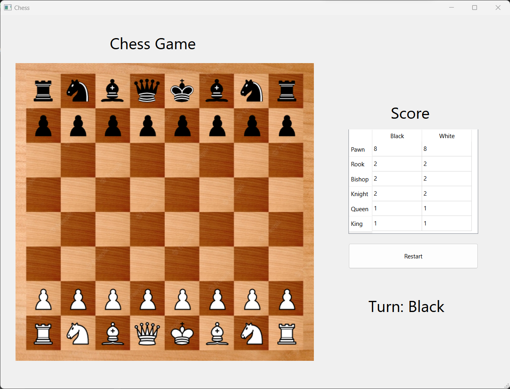
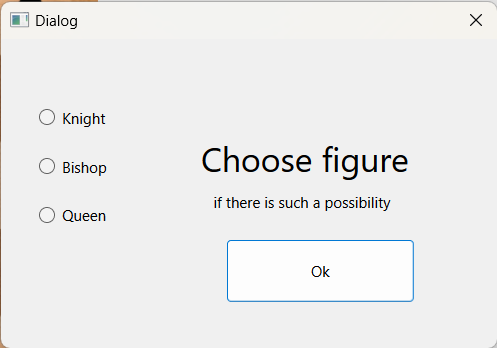

# Chess_Qt

Гра з графічним інтерфейсом для гри в шахи на одному комп'ютері.

## Опис

Chess_Qt - це програма, яка дозволяє користувачам насолоджуватися грою в шахи прямо на своєму комп'ютері. Вона має зручний інтерфейс, що дозволяє гравцям легко керувати фігурами та проводити партії з іншим гравцем за одним комп'ютером. 

## Використані технології

- **Qt Framework**: Гра була реалізована з використанням Qt Framework для розробки графічного інтерфейсу та обробки подій.
- **C++**: Мова програмування C++ використовувалася для написання логіки гри та взаємодії з інтерфейсом.
- **Git**: Репозиторій проекту був керований за допомогою Git для збереження та керування версіями програмного забезпечення.

## Встановлення та запуск

Для запуску проекту виконайте наступні кроки:

1. **Встановлення Qt SDK**: Спочатку вам потрібно встановити Qt SDK на ваш комп'ютер. Ви можете завантажити його з [офіційного сайту Qt](https://www.qt.io/download).
   
2. **Клонування репозиторію**: Клонуйте репозиторій на свій комп'ютер:

    ```bash
    git clone <URL_репозиторію>
    ```

3. **Відкриття проекту у Qt Creator**: Відкрийте склонований проект у Qt Creator.

4. **Налаштування проекту**: Перед компіляцією проекту переконайтеся, що налаштування проекту відповідають вашій операційній системі та встановленому Qt SDK.

5. **Компіляція та запуск**: Компілюйте та запускайте проект за допомогою Qt Creator.

## Приклади інтерфейсу

Вище наведені приклади інтерфейсу гри Chess_Qt:


Інтерфейс головного меню гри


Додаткове меню для вибору фігури для заміни

## Автор

**Олійник Юрій**

- Пошта: olijnikura@gmail.com
- Телеграм: [@rodtzdream](https://t.me/rodtzdream)

## Ліцензія

Цей проект розповсюджується без явної ліцензії. Він є вільним програмним забезпеченням, і ви можете використовувати, модифікувати та розповсюджувати його за вашим бажанням.
